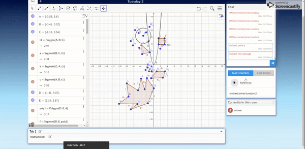

# Referencing

## Overview

When users are collaborating in a workspace they may have different orientations of the graph (because zooming/moving the graph is done on an indiviudal basis and is not broadcast to other members in the room). This can cause confusion when discussing GeoGebra objects in the chat because not all users may see the object you are discussing.

To reduce this confusion we've added a "Reference Tool" that allows users to click on GeoGebra objects and then write something about it in the chat. When other users click on that chat message, they will see a line connecting the message and the object.

Users can also reference other chat messages.

## Making A Reference

To make a reference the user can click on the reference icon or simply focus the chat input. This will activate "referencing". Then, when a GeoGebra object or chat message is clicked, a reference line will appear.

The other users will only be able to see this reference after the message is sent and they click on it.

## Determining Reference Position

All of the logic for managing references exists in `./Containers/Workspace/Workspace`
Additional logic for determining the position of the graph and the chat box exist in those components respectively.

When a user focuses the chat message or clicks the reference icon we toggle Workspace's `state.referencing` to `true`
